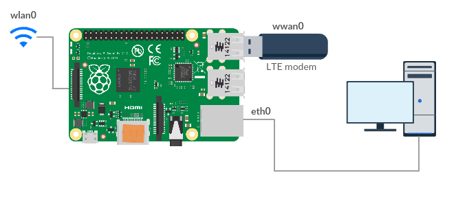

# Raspberry Pi LTE hotspot

Recently, I was looking for a solution to share my LTE USB modem connection to the rPi's LAN port. In my case I am going to connect rPi LAN port with my Unify USG secondary port to use rPi as a LTE failover connection.

We have 3 connections on the rPi:

1, **WiFi (wlan0)** - for any local internet access on rPi.
2, **LTE USB modem (wwan0)** - LTE internet connection
3, **LAN (eth0)** - we are going to share wwan0's connection with this interface.
